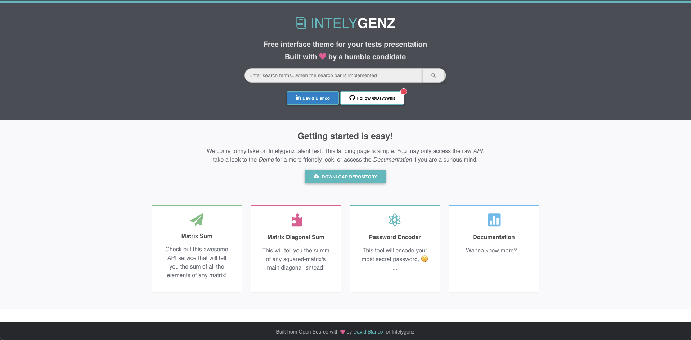

# Intelygenz talent test




<details>

[](#Installation)
<a href="#Installation"></a>

<summary> :floppy_disk: &nbsp; Installation</summary>

- ## :whale: &nbsp; Install Docker & Docker Compose

  https://docs.docker.com/get-docker/  
  https://docs.docker.com/compose/install/

- ## :closed_lock_with_key: &nbsp; Environment Variables

  To run this project, you will need to add the following environment variables regarding DB mapping to your `.env` file:

  `POSTGRES_NAME`

  `POSTGRES_USER`

  `POSTGRES_PASSWORD`

  <br/>And the following ones to setup an admin user for Django:

  `DJANGO_SUPERUSER_USERNAME`

  `DJANGO_SUPERUSER_EMAIL`

  `DJANGO_SUPERUSER_PASSWORD`

  <br/> A Boolean value for debugging session (Optional, default = False):

  `DEBUG`


- ## :wrench: &nbsp; Build and run container

  To build the container you can just run the `start.sh` script. The script will try to create a Django superuser (if it does not exist already):

  You may set the credentials via `.env` file and just run:
  ```bash
  sh start.sh
  ```

  Or explicitly before invoking the script:
  ```bash
   DJANGO_SUPERUSER_USERNAME=admin \
   DJANGO_SUPERUSER_EMAIL=admin@admin.com \
   DJANGO_SUPERUSER_PASSWORD=****** \
   sh start.sh
  ```

  (Optional) VSCode debugging setup is already integrated. A debugging session can be launched by setting truthy its variable:
  ```bash
  DEBUG=true sh start.sh
  ```

  (Optional) To run testing Suite:
  ```bash
  docker exec Django-server-container venv/bin/python -m pytest --verbosity=2 -l
  ```
  </details>

<br>

<details>

[](#aproach)
<a href="#aproach"></a>

  <summary> :triangular_ruler: &nbsp; Approach</summary>

- Marke it work locally :arrow_right: &nbsp;  Dockerize it
- Document readme at each commit made
- External app architecture. Abstract docker commands into bash scripts
- Clear folder structure
</details>

<br>

<details>

[](#testing)
<a href="#testing"></a>

  <summary> :microscope: &nbsp; Testing</summary>

  - Test run comand <i>docker exec Django-server-container venv/bin/python -m pytest --verbosity=2 -l</i>
  - Test right results :white_check_mark:
  - Test right input format:
    - Test input format is a list :white_check_mark:
    - Test squared matrix for main diagonal sum :white_check_mark:
    - Test no empty input :white_check_mark:


</details>

<br>

<!-- <details>

[](#bp)
<a href="#bp"></a>

  <summary> :cold_sweat: &nbsp; Blocking points</summary>


</details>

<br> -->

<details>

[](#cud)
<a href="#cud"></a>

  <summary> :soon: &nbsp; Currently under develop</summary>

  - Rest Swagger interface & API documentation
  - Login front page & auth configuration

</details>

<br>

<details>

[](#description)
<a href="#description"></a>

<summary><span> :pencil: &nbsp; Original Description</span></summary>
##_v1.0.0_

### What you’ll need
* A favorite text editor or IDE
* [Python 3.x](https://www.python.org/)
* [pip](https://pypi.org/project/pip/)
* [Virtualenv](https://virtualenv.pypa.io/en/latest/installation/)
* Minimum knowledge about [Flask Framework](http://flask.pocoo.org/)

### What you'll do
1. Download and unzip this source repository, or clone it using [Git](https://git-scm.com):  
  `git clone git@gitlab.com:intelygenz/igz-python-talent-test.git`
2. **Read the issue** that has been assigned to you.
3. **Create a merge request from the issue** from the issue detail screen, you can create a merge request to work on. When you create a merge request, a branch is also created.
5. **Work on the branch** until you feel you have resolved the issue.
6. Remove the **WIP** status on the merge request screen
7. You are ready to go!

More info: https://about.gitlab.com/2016/03/08/gitlab-tutorial-its-all-connected/

#### Create virtualenv
This is required once before installing dependencies
##### Windows
```
#Without Python in path
c:\Python35\python -m venv c:\path\to\myenv

#With python in path 
c:\>python -m venv c:\path\to\myenv
```
##### UNIX
```
python3 -m venv venv
```
#### Activate virtualenv
This is required before installing dependencies or running the project.
##### Windows
```
venv\Scripts\activate
```
##### UNIX
```
source venv/bin/activate
```
Once virtualenv is activated, your prompt will change. To deactivate it, run
```
deactivate
```
#### Install dependencies
With virtualenv enabled, run
```
pip install -r requirements.txt
```
#### Run the Project
With virtualenv enabled, run
```
python main.py
```

#### Test the services
```
curl --header "Content-Type: application/json" \
  --request POST \
  --data '{ "matrix": [ [ 1, 2, 3], [4, 5, 6], [7, 8, 9] ] }' \
  http://localhost:5000/api/matrix/sum
```
```
curl --header "Content-Type: application/json" \
  --request POST \
  --data '{ "matrix": [ [ 1, 2, 3], [4, 5, 6], [7, 8, 9] ] }' \
  http://localhost:5000/api/matrix/diagonal_sum
```
```
curl --header "Content-Type: application/json" \
  --request POST \
  --data '{ "string": "aaAabaccCBb" }' \
  http://localhost:5000/api/string/encode
```
### Mandatory
**Push the create branch to remote for evaluate the solution.**

### Important
_Please, feel free to contact us if you need more information by writting a comment in the asigned issue and we will respond asap._


</details>


